```{r setup}
options(
  knitr.table.format = "html",
  scipen = 999
)
```

```{=html}
<div style="position:absolute; top:10px; right:10px;">

</div>
```

```{=html}
<style>
body{
  background-color:#f7f6ed;
  font-size:130%;
  text-align:justify;
}
</style>
```

```{r}
ipak <- function(pkg){

  options(repos = c(CRAN="https://cloud.r-project.org"))

  new.pkg <- pkg[!(pkg %in% rownames(installed.packages()))]

  if(length(new.pkg)) install.packages(new.pkg, dependencies = TRUE)

  invisible(lapply(pkg, function(p)
    suppressPackageStartupMessages(library(p, character.only = TRUE))
  ))
}

packages <- c("tidyverse","kableExtra","psych","readxl")

ipak(packages)
```

# introducción

En el dia de hoy vamos a hacer un tutorial paso a paso de como subir tu página a un repositorio de github, gracias a los problemas que he visto que surgieron. <br>

# crear el proyecto normal en R Quarto

primero haremos todo lo que tengamos que hacer en el documento de quarto, poner o quitar información, eso depende de que es lo que ustedes quieran mostrar. Después lo guardamos como index (muy importante)

# paquetes

cuando ya esté terminado el Quarto y lo hayamos guardado vamos a ir a ese icono debajo de files <br> <br> 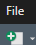 <br> <br> y creamos un R Script (o podemos oprimir ctrl + shift + N en el teclado)

En el R Script lo primero que vamos a hacer es escribir [install.packages("usethis")]{style="color: red;"} (las comillas son importantes) esto se hace para instalar los paquetes necesarios para subir esto a git. Después le damos a "Run" o podemos oprimir ctrl + enter para que se instalen los paquetes

<br>

lo segundo que haremos es escribir [library(usethis)]{style="color: red;"} (importante que sea sin comillas) esto para activar dichos paquetes. Lo mismo de Run o ctrl + enter

<br>

después escribiremos [use_git()]{style="color: red;"} y otra vez, Run Después de runnear (darle run) les aparecerá 3 opciones, 2 negativas y una postivia, le darán a la positiva y esperán

<br>

después [use_github()]{style="color: red;"} y otra vez Run, aquí ya debió haber creado el repositorio y les abrirá automáticamente el navegador

debería quedar de esta manera: <br> <br>

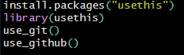

# repositorio

aquí el repositorio estará creado, pero no servirá para nada por ahora, primero lo que haremos será escribir en el script [use_github_pages()]{style="color: red;"} y le dan a run. Esto creará otra rama (o branch) aparte de la llamada "masters".

El problema es que esta rama no tiene nada... y si esta rama no tiene nada no podemos desplegar la página, entonces ¿cómo podemos hacer que si tenga algo?

En la página del github, le daremos a settings <br> 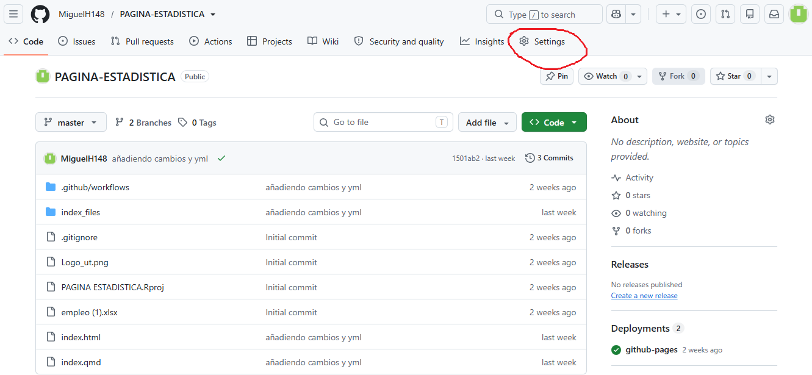 <br> después a actions <br> 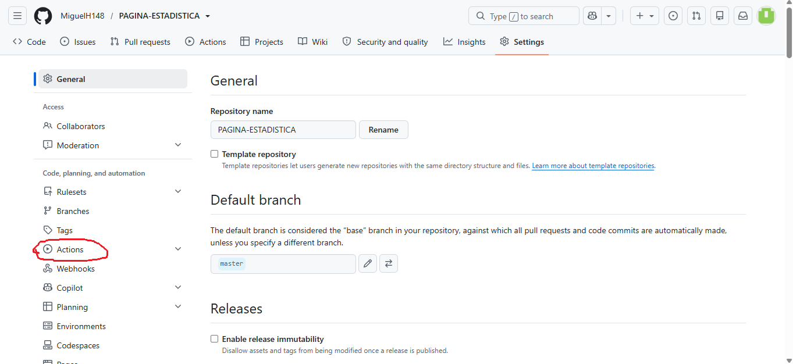 <br> después a general <br> 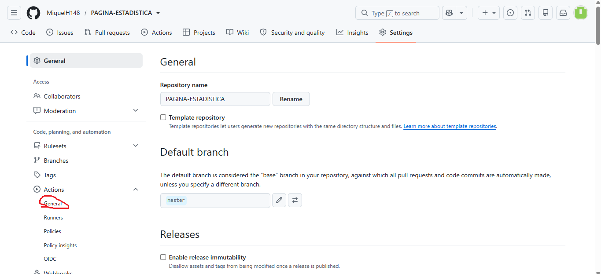 <br> bajamos hasta donde dice workflows permisions y seleccionamos la primera opción <br> 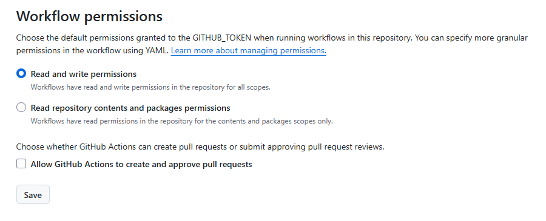 Después volvemos al R y creamos unas cuantas carpetas (le damos a files y new folder) 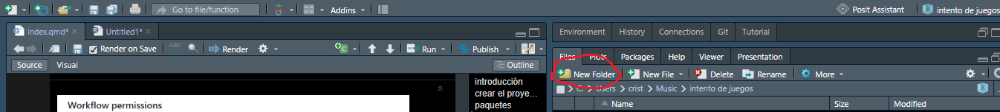 la primera carpeta se llamará [.github]{style="color: red;"}

<br> la segunda carpeta se llamará [workflows]{style="color: red;"}

y lo tercero no será una carpeta, será un archivo de texto, osea que le daremos al que está al lado de new folder, osea [new file]{style="color: red;"} y seleccionarmeos [text file]{style="color: red;"} <br> 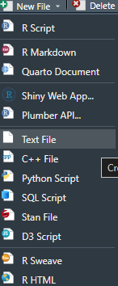 <br>

este archivo lo tienen que llamara como [deploy-gh-pages.yml]{style="color: red;"}

<br>

se les abrirá un archivo de texto en blanco, en ese archivo de texto lo que tienen que hacer es copiar y pergar lo que aparece en el siguiente link: <br> <https://gist.githubusercontent.com/irwingss/c7993e545654740ef21df3ccba9b2add/raw/aa71e4739f874f537145b6ae39cbdb90cec386fc/gistfile1.txt> <br> renderizan y guardan el archivo de texto

# subir al repositorio

ahora vamos con la "ultima parte" en la cual tendremos que ir a [terminal]{style="color: red;"} <br> 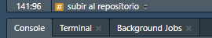 y aquí tenemos que escribir las siguientes 3 cosas:

[1. git add .]{style="color: red;"}
<br>
[2. git commit -m "añadiendo cambios y yml"]{style="color: red;"}  nota: lo que está entre las comillas es solo un mensaje, no necesariamente tiene que ser ese, con tal de que esté en comillas todo bien (ya lo intenté)
<br>
[3. git push]{style="color: red;"}

es importante que recuerden bien los espacios y signos o si no no funcionará

[NOTA IMPORTANTE:]{style="color: red;"} para hacer todo esto primero debieron haber hecho lo de iniciar sesión en github, hacer lo del gitbash (o la aplicación que dejaré como imagen abajo) y crear el token (no lo creía necesario pero parece que si lo es, al menos la primera vez que se hace) <br> <br> 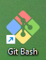 <br> <br>

# los verdaderos últimos pasos

cuando hayamos hecho todo eso nos vamos al repositorio y volvemos a cargar la página hasta que el simbolo que señalaré tenga un chulo <br> <br> 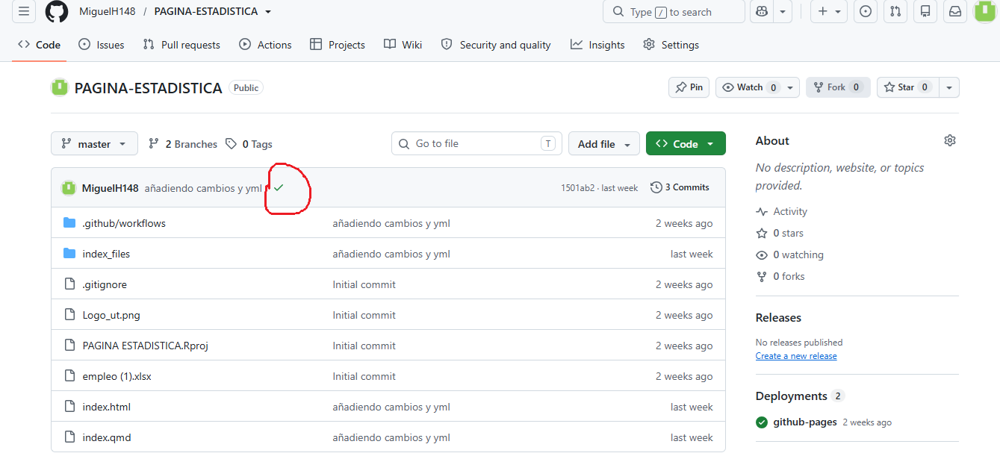 <br> <br>

después de que ya esté ese simbolo vamos a volver a ir a settings <br> <br>  <br> <br> pero ahora bajamos hasta donde dice pages <br> <br> 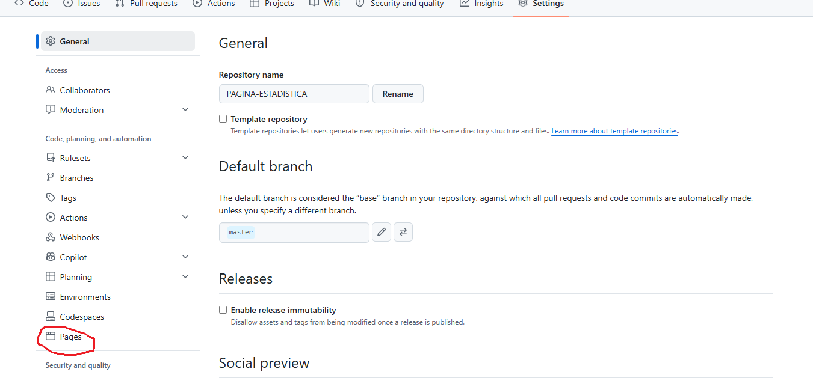 y como podemos observar hay un lugar donde dice "none" (lo que está encerrado en verde) le damos ahí, y vemos 3 opciones, seleccionamos la que dice "gh-pages" y después le damos a "save"

<br>
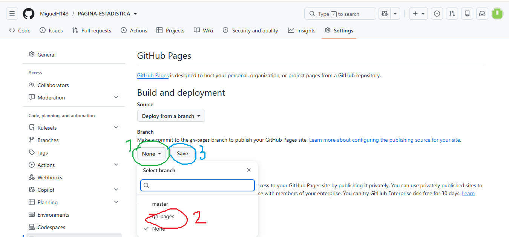

<br>

después vamos de nuevo a "code" <br> <br> 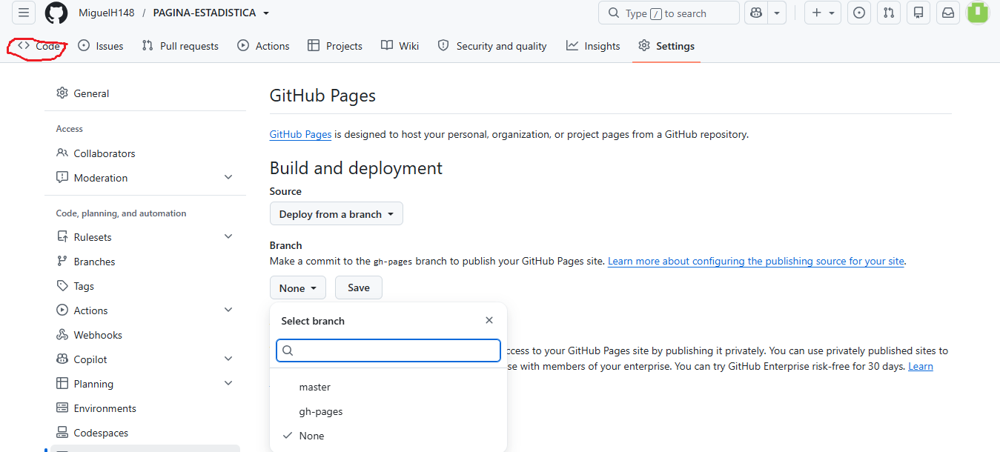 y ahí le damos a voler a cargar hasta que en la parte donde dice deployments (o lo que está encerrado en su defecto) diga [now]{style="color: red;"} (en lugar de "2 weeks ago en mi caso" <br> <br> 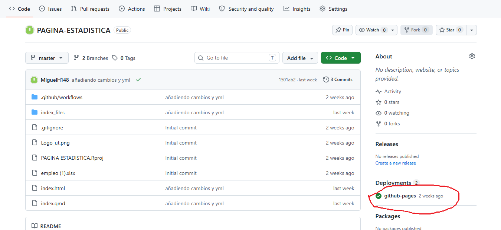

# celebrar

y listo, en teoría ya debería estar... si no les funciona preguntenle a Santiago como es su método, sin más que decir, me despido

chao
